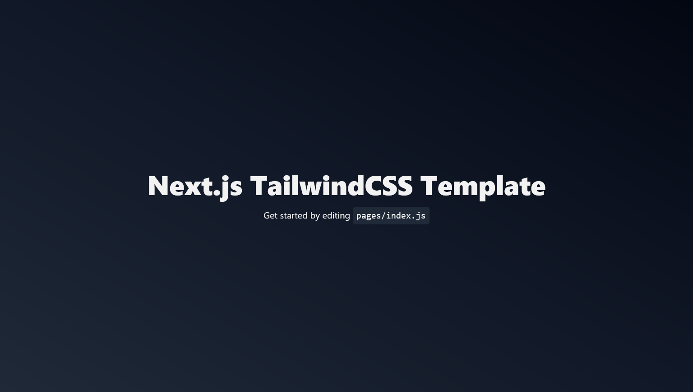

# Next.js TailwindCSS Template
This repository is a starter template for any project that uses Next.js and TailwindCSS.

The aim of this project is to create a good starting point for my future projects in Next.js that use TailwindCSS.

## Preview


## Tech Stack
### Front-end:
- [React.js](https://react.dev/)
- [Next.js](https://nextjs.org/)
- [Tailwind CSS](https://tailwindcss.com/)
### Back-end:
- There's no backend 💀

## Local Development
### 1. Clone the project
1. Clone the repository into your system and install the dependencies.
```bash
$ git clone https://github.com/Jeydin21/Next.js-TailwindCSS-Template.git
$ cd Next.js-TailwindCSS-Template
$ npm install # Or yarn install
```

### 2. Start local development
1. Create a local development server.
```bash
$ npm run dev
```
2. Open the preview [localhost:3000](http://localhost:3000) in your browser.

## License
This project is licensed under the [MIT License](https://opensource.org/license/mit) - see the [License](https://github.com/Jeydin21/Next.js-TailwindCSS-Template/blob/main/LICENSE) file for more details